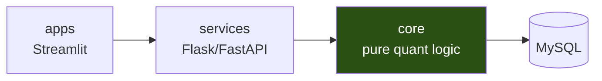

# Cedge

A quant research platform built around one architectural constraint:
**calculation logic never knows about HTTP, databases, or UI.**

Most research codebases start as notebooks and grow into monoliths where
a VaR calculation is tangled with a Flask route and a Streamlit widget.
Cedge separates them: `core` computes, `services` exposes, `apps` renders.
Each layer is independently testable, and swapping the API framework or
the UI doesn't touch a single line of quant logic.

[](https://github.com/ChrisIJH/cedge/actions/workflows/ci.yml)

## Architecture



Dependencies flow one way. `core` never imports from `services` or `apps`,
and never imports an HTTP or UI framework.

## What's in `core`

| Module | What it does |
|---|---|
| `risk/` | VaR & Expected Shortfall — parametric and Filtered Historical Simulation, with Kupiec / Christoffersen backtests |
| `portfolio/` | Performance attribution, turnover, rolling statistics |
| `regime/` | Market regime classification from volatility, credit, and rates signals |
| `marketdata/` | Price and return series, weight normalization |

## Testing approach

Quant code fails silently — a subtly wrong covariance matrix still returns
a number. Cedge uses **known-answer tests**: each calculation is verified
against an independently derived value, so a regression breaks the build
rather than quietly shifting a risk number.

```bash
pytest                    # full suite
pytest -m "not db"        # skip tests requiring a database
```

## Running a service

Each service ships as a container:

```bash
docker build -t cedge-portfolio-performance services/portfolio_performance
docker run -p 8000:8000 cedge-portfolio-performance
curl localhost:8000/healthz
```

Multi-stage build, non-root user, HEALTHCHECK included.

## Local development

```bash
pip install -e ".[dev]"
pytest
```

## Status

`core` and one extracted service are production-shaped. The Streamlit
layer (`apps/`) is being migrated next — it will consume the HTTP API
only, never importing `core` directly.

Architecture and migration notes: [`docs/`](docs/)