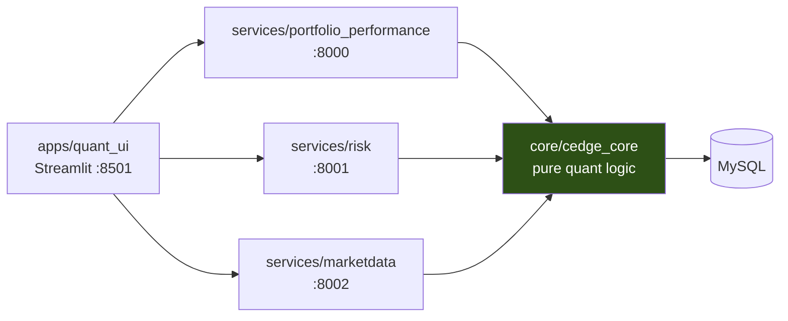

# Cedge

Cedge is a quant research platform for long/short portfolio analysis —
performance attribution, VaR/ES risk, and their backtests — built as three
independent layers: `core` (pure calculation), `services` (HTTP APIs),
`apps` (Streamlit UI). Calculation logic in `core` never imports an HTTP
or UI framework and never sees a database connection except behind an
injectable repository; each layer can be tested, deployed, and understood
on its own.

This repo is not written from scratch — it's extracted and rewritten from
several years of research code across three private repos (a core quant
engine, a Flask risk API, and a Streamlit PM workspace). What's public is
the part that's been pulled out, given a real boundary, and covered with
tests — not everything that exists, but everything that's been made to
hold up.

[](https://github.com/ChrisIJH/cedge/actions/workflows/ci.yml)

## Architecture



Dependencies flow one way. `core` never imports from `services` or `apps`,
never imports an HTTP or UI framework, and never sees a database
connection except behind an injectable repository (see Design decisions).
`apps` never imports `core` or opens a database connection — every number
on screen arrives over HTTP.

## What's in `core`

| Module | What it does |
|---|---|
| `risk/` | VaR & Expected Shortfall — parametric and Filtered Historical Simulation, with Kupiec / Christoffersen / Acerbi–Székely backtests |
| `portfolio/` | Long/short performance, turnover, rolling statistics |
| `marketdata/` | Prices, returns, portfolio definitions, weight normalization |

## What's in `services`

| Service | Port | Exposes |
|---|---|---|
| `portfolio_performance` | 8000 | Cumulative return + stats for a long/short book |
| `risk` | 8001 | Rolling VaR/ES (parametric, FHS) and their backtests |
| `marketdata` | 8002 | Portfolio lookup, as-of weight snapshots, portfolio → return series |

## What's in `apps`

`quant_ui` (Streamlit, port 8501) — a thin client over the three services
above. Two pages so far:

| Page | Backed by |
|---|---|
| Portfolio Performance | `portfolio_performance` |
| VaR Backtest | `marketdata` + `risk` |

## Design decisions

**Functional core / imperative shell, applied twice.** `portfolio/prices.py`
and `marketdata/portfolios.py` each define a `Protocol` (structural typing,
not an ABC) plus one SQL-backed implementation — `SqlPriceRepository`,
`SqlPortfolioRepository`. The class is the only thing in its module that
touches a database; everything downstream (`stats.py`, `weights.py`, all
of `risk/`) is pure functions over already-loaded data. A test injects a
fake repository and exercises real orchestration logic with no database —
see `tests/cedge_core/portfolio/test_performance.py`.

**A backward-compatible shim, `portfolio/analytics.py`.** When
`portfolio/` was split into `stats.py` (pure calculation) / `prices.py`
(DB access) / `performance.py` (orchestration), existing call sites kept
importing from the old module path. `analytics.py` re-exports the new
functions under the old name — the internal structure changed without
breaking anything that depended on it.


**Fixed-weight views are labeled as such.** `services/marketdata`'s
`/api/portfolio_returns` applies one weight snapshot across an entire date
range — useful for asking "how would this book have behaved," but that is
look-ahead in the strict sense (today's position applied to years of past
returns) if mistaken for a rebalanced backtest. The endpoint's response
and the VaR Backtest page both say so explicitly.

## Testing approach

Cedge uses **known-answer tests**: each calculation is verified
against an independently derived value, so a regression breaks the build
rather than quietly shifting a risk number. Service-level tests are split
by whether they need a database (`@pytest.mark.db`) — validation and
orchestration logic run in CI with no database attached; anything that
reads real prices or portfolios is excluded from CI and run locally.

```bash
pytest                    # full suite (needs a database)
pytest -m "not db"        # what CI runs
```

## Running a service

Each service ships as a container — multi-stage build, non-root user,
`HEALTHCHECK` included:

```bash
docker build -t cedge-risk -f services/risk/Dockerfile .
docker run -p 8001:8000 cedge-risk
curl localhost:8001/healthz
```

`risk` has no database dependency and runs standalone. `portfolio_performance`
and `marketdata` need `CEDGE_DB_USER` / `CEDGE_DB_PASSWORD` /
`CEDGE_DB_HOST` (see `core/cedge_core/db.py`).

## Running the UI

```bash
pip install -r apps/quant_ui/requirements.txt
streamlit run apps/quant_ui/app.py
```

Reads service URLs from `CEDGE_<SERVICE>_API_URL` environment variables,
defaulting to `localhost` on each service's port above.

## Local development

```bash
pip install -e ".[dev]"
pytest -m "not db"
```

## Status

**In this repo:** the three services and two UI pages above, all with CI
and known-answer test coverage.

**Exists in a separate, operating system — not in this public repo:**
regime classification, portfolio optimization, factor/PCA risk models,
decision workflow and sensitivity analysis, and the What-If experiment
engine. These are real and running; they aren't here because each depends
on infrastructure (a factor risk store, an experiment tracking schema).


**Known limitations:** tracked as [GitHub issues](https://github.com/ChrisIJH/cedge/issues) —
currently one open, an `instrument_type` filter in `portfolio_performance`
that blocks ETF tickers.

